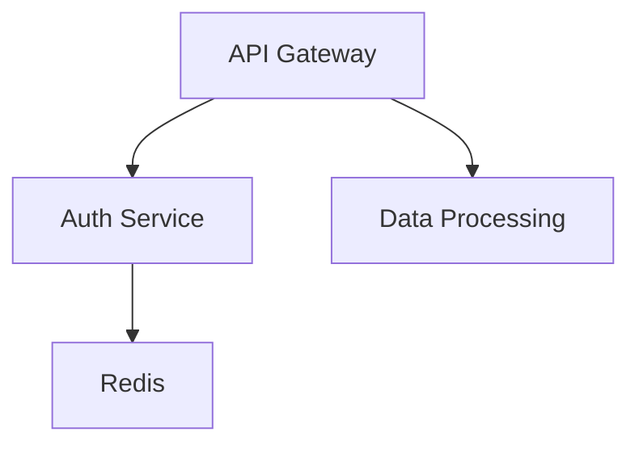

# Missing Dimensions: Comprehensive Experimental Space

## What You Identified

### 1. Logical Languages

**Your mention:** Lean, Lojban (different categories of logical languages)

**Why this matters:**

**A. Formal Verification (Lean)**

Lean is a **theorem prover** - formal mathematical reasoning system.

**Use case in investigation:**
```lean
-- Represent knowledge as formal propositions
theorem memory_leak_timeline :
  fixed_date test_leak < fixed_date prod_leak :=
begin
  -- Date arithmetic proof
  norm_num [test_leak_date, prod_leak_date],
end
```

**Benefits:**
- ✓ **Provably correct reasoning** - mathematical certainty
- ✓ **No hallucination** - can't state false theorems
- ✓ **Compositional** - build complex proofs from simple ones
- ✓ **Verifiable** - machine-checkable

**Challenges:**
- ✗ Requires formal knowledge representation (hard)
- ✗ Not all knowledge is formalizable
- ✗ Steep learning curve
- ✗ Manual proof construction (or need proof search)

**Experimental question:**
> Can we represent investigation questions as formal logic problems and use proof assistants to guarantee correct answers?

**B. Logical Language (Lojban)**

Lojban is a **constructed language** designed for unambiguous communication.

**Properties:**
- No syntactic ambiguity
- Clear predicate structure
- Explicit logical relationships
- Parse-tree directly reflects semantics

**Example:**
```
English: "The old man's hat"
Ambiguous: (old (man's hat)) or ((old man)'s hat)?

Lojban: "le tolci'o nixli ku'o se kamju"
Unambiguous parse structure
```

**Use case in investigation:**
```
Question: "Which memory leak was fixed first?"

Lojban representation:
- da poi memri tuple
- de poi memri tuple
- da cenba de
- pilno fi pa'u pamoi

Clear predicate logic structure
```

**Benefits:**
- ✓ **Eliminates linguistic ambiguity**
- ✓ **Direct mapping to predicate logic**
- ✓ **Compositional semantics**

**Challenges:**
- ✗ Requires translation (English → Lojban)
- ✗ Loss of natural language nuance
- ✗ Limited tooling/community

**Experimental question:**
> Does representing queries in logical language improve reasoning accuracy?

**C. Other Logical Representation Systems**

**Prolog:**
- Logic programming
- Pattern matching + backtracking
- Natural for rule-based reasoning

**Example:**
```prolog
% Facts
fixed(test_leak, date(2026, 1, 12)).
fixed(prod_leak, date(2026, 1, 22)).

% Rule
first_fixed(X, Y) :- fixed(X, D1), fixed(Y, D2), D1 @< D2.

% Query
?- first_fixed(What, prod_leak).
What = test_leak.
```

**Datalog:**
- Subset of Prolog
- More restricted (guaranteed termination)
- Used in knowledge graphs (Datomic, LogicBlox)

**Answer Set Programming (ASP):**
- Non-monotonic reasoning
- Handle defaults, exceptions
- Good for planning problems

**Experimental space:**

| Logic System | Strength | Weakness | Use Case |
|--------------|----------|----------|----------|
| Lean | Formal proofs | Hard to use | Critical reasoning |
| Lojban | Unambiguous language | Translation overhead | Query parsing |
| Prolog | Pattern matching | Can be slow | Rule-based QA |
| Datalog | Guaranteed termination | Limited expressiveness | Graph queries |
| ASP | Non-monotonic | Complex semantics | Planning |

---

### 2. Special Classes of Language Models

**Your mention:** LoRA, BERT

**Why this matters:** Different model architectures have different capabilities.

**A. BERT (Encoder-Only)**

**Architecture:**
- Bidirectional encoder
- No text generation
- Outputs embeddings/classifications

**Strengths:**
- ✓ **Excellent at understanding** (semantic similarity)
- ✓ **Fast inference** (no autoregressive decoding)
- ✓ **Smaller models** (110M-340M params)
- ✓ **Good for retrieval** (sentence embeddings)

**Weaknesses:**
- ✗ **Cannot generate text** (no answers, only scores)
- ✗ **Cannot reason in natural language**
- ✗ **Limited to classification/embedding tasks**

**Use in investigation board:**
```python
# BERT for retrieval ranking
query_embedding = bert.encode(question)
doc_embeddings = [bert.encode(doc) for doc in documents]
scores = cosine_similarity(query_embedding, doc_embeddings)

# Then use generative model for answer
answer = llm.generate(f"Question: {question}\nDocs: {top_docs}")
```

**Hybrid architecture:**
- BERT for retrieval (fast, accurate)
- GPT/LLaMA for reasoning (slow, creative)

**B. LoRA (Low-Rank Adaptation)**

LoRA is a **fine-tuning technique**, not a model type.

**What it is:**
- Fine-tune large models efficiently
- Add low-rank matrices to frozen weights
- Train only a small fraction of parameters

**Example:**
```python
# Base model: Llama3.2 (8B params)
# LoRA: Only 8M params trained (~0.1%)

# Fine-tune on investigation tasks
lora_model = finetune_lora(
    base_model="llama3.2",
    dataset=investigation_qa_pairs,
    rank=16  # Low-rank dimension
)
```

**Benefits:**
- ✓ **Domain adaptation** - specialize for investigation tasks
- ✓ **Fast training** - hours instead of days
- ✓ **Low memory** - can train on consumer GPU
- ✓ **Swappable** - plug different LoRAs into same base

**Use case:**
```python
# Base model
base_llm = load_model("llama3.2")

# Different LoRA adapters for different domains
temporal_lora = load_lora("temporal_reasoning.lora")
causal_lora = load_lora("causal_reasoning.lora")
calculation_lora = load_lora("arithmetic.lora")

# Swap adapter based on question type
if is_temporal_question(q):
    model = base_llm.with_lora(temporal_lora)
elif is_causal_question(q):
    model = base_llm.with_lora(causal_lora)
```

**Experimental question:**
> Can we improve investigation performance by fine-tuning LoRAs on specific reasoning types?

**C. Other Model Architectures**

**T5 (Encoder-Decoder):**
- Good for text-to-text tasks
- Can frame everything as "input → output"
- Used for question answering, summarization

**Mixture of Experts (MoE):**
- Multiple sub-models (experts)
- Route queries to relevant experts
- Efficient scaling

**Example:**
```python
# Different experts for different question types
experts = {
    'temporal': TemporalReasoningExpert(),
    'causal': CausalReasoningExpert(),
    'calculation': ArithmeticExpert(),
    'semantic': SemanticUnderstandingExpert(),
}

# Router decides which expert(s) to use
expert_weights = router(question)
answer = weighted_combination([e.answer(question) for e in experts], expert_weights)
```

**Retrieval-Augmented Generation (RAG) Models:**
- Built-in retrieval mechanism
- Dense retrieval + generation in one
- Examples: RETRO, Atlas

**Small Language Models (SLMs):**
- <1B parameters
- Fast, efficient
- Good for specific tasks

**Experimental space:**

| Model Type | Size | Speed | Reasoning | Use Case |
|------------|------|-------|-----------|----------|
| BERT | Small | Fast | Limited | Retrieval only |
| T5 | Medium | Medium | Good | QA tasks |
| GPT/LLaMA | Large | Slow | Excellent | General reasoning |
| MoE | Large | Medium | Excellent | Specialized tasks |
| SLM | Tiny | Very fast | Limited | Simple queries |
| LoRA-adapted | Large | Slow | Specialized | Domain-specific |

---

### 3. Investigation Tracing and Self-Improvement Loops

**Your mention:** Investigation tracing and loop of self-improvement

**Why this matters:** Meta-level capabilities for the investigation engine itself.

**A. Investigation Tracing**

**What it is:** Record the reasoning process, not just the answer.

**Example trace:**
```json
{
  "question": "Which memory leak was fixed first?",
  "trace": [
    {
      "step": 1,
      "action": "search",
      "tool": "search_knowledge",
      "input": {"query": "memory leak"},
      "output": ["test-suite-issues.md", "auth-memory-leak-investigation.md"],
      "reasoning": "Need to find all memory leak mentions"
    },
    {
      "step": 2,
      "action": "extract",
      "tool": "extract_dates",
      "input": {"docs": ["test-suite-issues.md", "auth-memory-leak-investigation.md"]},
      "output": {"test": "2026-01-12", "auth": "2026-01-22"},
      "reasoning": "Need dates to compare temporal order"
    },
    {
      "step": 3,
      "action": "compare",
      "tool": "compare_dates",
      "input": {"date1": "2026-01-12", "date2": "2026-01-22"},
      "output": "2026-01-12 is earlier",
      "reasoning": "Temporal comparison to determine 'first'"
    },
    {
      "step": 4,
      "action": "synthesize",
      "tool": "llm_generate",
      "input": {"template": "The {entity} was fixed first on {date}"},
      "output": "The test suite memory leak was fixed first on 2026-01-12",
      "reasoning": "Natural language answer generation"
    }
  ],
  "answer": "The test suite memory leak was fixed first on 2026-01-12",
  "confidence": 0.95,
  "sources": ["test-suite-issues.md", "auth-memory-leak-investigation.md"]
}
```

**Benefits:**
- ✓ **Explainability** - see how answer was derived
- ✓ **Debuggability** - find where reasoning failed
- ✓ **Auditability** - verify correctness
- ✓ **Learning** - analyze successful vs failed traces

**Implementation:**
```python
class InvestigationTracer:
    def __init__(self):
        self.trace = []

    def log_step(self, action, tool, input, output, reasoning):
        self.trace.append({
            'step': len(self.trace) + 1,
            'action': action,
            'tool': tool,
            'input': input,
            'output': output,
            'reasoning': reasoning,
            'timestamp': time.time()
        })

    def get_trace(self):
        return self.trace
```

**B. Self-Improvement Loops**

**What it is:** System learns from its mistakes and successes.

**Pattern 1: Failure Analysis**
```python
# After each question
if answer_correct:
    # Store successful trace
    success_db.add(question, trace, answer)
else:
    # Analyze failure
    failure_analysis = analyze_trace(trace, correct_answer)
    # Store failure pattern
    failure_db.add(question, trace, failure_analysis)

# Periodically review failures
def improve_system():
    common_failures = failure_db.get_patterns()
    for failure_type in common_failures:
        # Add tool, improve prompt, tune threshold, etc.
        apply_fix(failure_type)
```

**Pattern 2: Reinforcement Learning from Human Feedback (RLHF)**
```python
# User rates answers
user_feedback = {
    'question': question,
    'answer': answer,
    'rating': 1-5,  # User rating
    'correction': "Correct answer is...",  # If wrong
}

# Update model/system
if rating < 3:
    # Learn from negative feedback
    update_model(question, answer, correction, reward=-1)
else:
    # Reinforce good behavior
    update_model(question, answer, reward=+1)
```

**Pattern 3: Active Learning**
```python
# System identifies uncertain cases
def identify_uncertain_questions():
    uncertain = []
    for q in question_bank:
        # Try multiple strategies
        answers = [
            strategy1.answer(q),
            strategy2.answer(q),
            strategy3.answer(q)
        ]
        # If answers disagree, uncertain
        if len(set(answers)) > 1:
            uncertain.append(q)
    return uncertain

# Ask human to label uncertain cases
for q in uncertain:
    human_answer = ask_human(q)
    training_data.add(q, human_answer)

# Retrain/improve
improve_with_data(training_data)
```

**Pattern 4: Meta-Learning (Learning to Learn)**
```python
# Track which strategies work for which question types
strategy_performance = {
    'temporal_questions': {
        'graph_traversal': 0.85,  # 85% accuracy
        'llm_only': 0.60,
        'logic_engine': 0.95,     # Best for temporal
    },
    'causal_questions': {
        'graph_traversal': 0.70,
        'llm_only': 0.75,          # Best for causal
        'logic_engine': 0.50,
    }
}

# Choose strategy based on question type
def answer_with_meta_learning(question):
    q_type = classify_question(question)
    best_strategy = max(
        strategy_performance[q_type],
        key=strategy_performance[q_type].get
    )
    return best_strategy.answer(question)
```

**Pattern 5: Curriculum Learning**
```python
# Start with easy questions, progress to hard
difficulty_levels = [
    'trivial',         # Keyword matching
    'simple_multi_hop', # 2 documents
    'complex_multi_hop', # 3+ documents
    'reasoning_heavy',  # Temporal, causal, calculation
]

# Train incrementally
for level in difficulty_levels:
    questions = get_questions_by_difficulty(level)
    train(questions)
    if accuracy(level) > 0.8:
        # Move to next difficulty
        continue
    else:
        # Stay at current level until mastery
        break
```

**Experimental questions:**
- Does tracing improve explainability?
- Can failure analysis identify systematic weaknesses?
- Does RLHF improve accuracy over time?
- Can meta-learning optimize strategy selection?

---

## What Else You're Missing

### 4. Uncertainty and Confidence Handling

**Problem:** LLMs hallucinate, searches fail, reasoning might be incorrect.

**Missing capability:** "I don't know" detection and confidence estimation.

**Implementation:**
```python
class ConfidenceAwareAnswer:
    def __init__(self, answer, confidence, reasoning):
        self.answer = answer
        self.confidence = confidence  # 0-1
        self.reasoning = reasoning

    def should_present(self):
        if self.confidence < 0.5:
            return "I'm not confident in this answer"
        elif self.confidence < 0.7:
            return f"{self.answer} (low confidence)"
        else:
            return self.answer

# Confidence from multiple sources
def calculate_confidence(answer, trace):
    factors = {
        'retrieval_quality': score_retrieval(trace.docs),
        'reasoning_coherence': score_reasoning(trace.steps),
        'source_agreement': check_contradictions(trace.docs),
        'model_uncertainty': get_model_entropy(answer),
    }
    return weighted_average(factors)
```

**Uncertainty patterns:**
```python
# Pattern 1: Missing information
if not found_all_required_facts(trace):
    return Answer(
        text="I don't have enough information to answer this",
        confidence=0.0,
        missing_info=["Need to know when X happened"]
    )

# Pattern 2: Contradictory sources
if has_contradictions(docs):
    return Answer(
        text="Sources contradict each other",
        confidence=0.3,
        contradictions=[("doc1 says X", "doc2 says Y")]
    )

# Pattern 3: Low retrieval quality
if max_retrieval_score < threshold:
    return Answer(
        text="No relevant documents found",
        confidence=0.2,
        suggestion="Try rephrasing the question"
    )
```

---

### 5. Query Understanding and Clarification

**Problem:** User questions are ambiguous, misspelled, or vague.

**Missing capability:** Query refinement and clarification dialogue.

**A. Spell Correction**
```python
# "Which memry leak was fixed first?"
corrected = spell_check(query)
if corrected != query:
    ask_user(f"Did you mean: {corrected}?")
```

**B. Ambiguity Detection**
```python
# "Which timeout was increased?"
# Multiple timeouts exist: file upload, network test, database

if detect_ambiguity(query):
    clarify = ask_user(
        "Multiple timeouts found:",
        options=[
            "File upload timeout",
            "Network test timeout",
            "Database connection timeout"
        ]
    )
    query = refine_query(query, clarification)
```

**C. Query Expansion**
```python
# "What bottleneck was eliminated?"
# User says "bottleneck", docs say "slow part", "performance issue"

expanded_query = {
    'original': 'bottleneck',
    'synonyms': ['slow part', 'performance issue', 'latency problem'],
    'related': ['optimization', 'speedup', 'improvement']
}

# Search with all terms
results = search_with_expansion(expanded_query)
```

**D. Intent Classification**
```python
# What is the user trying to do?
intents = {
    'fact_lookup': "What port does X run on?",
    'comparison': "Which was faster?",
    'explanation': "Why did Y happen?",
    'procedure': "How do I do X?",
    'timeline': "When did X happen?",
}

intent = classify_intent(query)
# Route to appropriate strategy
```

---

### 6. Multi-Modal Knowledge

**Problem:** Knowledge isn't just text - diagrams, code, images matter.

**Missing capability:** Handle non-text knowledge sources.

**A. Code Integration**
```markdown
---
title: "Authentication Fix"
code_refs:
  - file: "auth_service/token_manager.py"
    lines: 45-67
    function: "renew_token"
---

The fix was in the `renew_token()` function:
```python
def renew_token(self, user_id):
    # Old code caused leak
    self.token_cache[user_id] = new_token  # ❌

    # New code with cleanup
    self.token_cache.set(user_id, new_token, ttl=3600)  # ✓
```
```

**B. Diagram/Architecture Visualization**
```markdown
---
title: "System Architecture"
diagrams:
  - type: "mermaid"
    file: "architecture.mmd"
---


```

**C. Image/Screenshot References**
```markdown
---
title: "Performance Metrics"
images:
  - file: "dashboard_before.png"
    caption: "Dashboard load time: 2.1s"
  - file: "dashboard_after.png"
    caption: "Dashboard load time: 0.8s"
---
```

**Retrieval implications:**
- Need to index code (semantic code search)
- Need to OCR images (extract text)
- Need to understand diagrams (vision models)

---

### 7. Contradiction Detection and Resolution

**Problem:** Knowledge base may contain conflicting information.

**Missing capability:** Detect and resolve contradictions.

**Example:**
```
Doc A (Jan 18): "Redis endpoint is redis-1.internal.local"
Doc B (Jan 25): "Migrated to redis-2.internal.local"

Question: "What is the Redis endpoint?"
```

**Resolution strategies:**
```python
def resolve_contradiction(statements):
    # Strategy 1: Temporal (use most recent)
    if all_have_dates(statements):
        return max(statements, key=lambda s: s.date)

    # Strategy 2: Source authority (trust official docs)
    if has_authoritative_source(statements):
        return get_authoritative(statements)

    # Strategy 3: Ask user
    return ask_user_to_resolve(statements)
```

**Implementation:**
```python
class ContradictionDetector:
    def detect(self, statements):
        # Check if statements about same entity disagree
        entities = group_by_entity(statements)
        contradictions = []
        for entity, stmts in entities.items():
            if len(set(stmt.value for stmt in stmts)) > 1:
                contradictions.append({
                    'entity': entity,
                    'conflicting_values': stmts,
                })
        return contradictions

    def resolve(self, contradiction):
        # Apply resolution strategy
        return temporal_resolution(contradiction)
```

---

### 8. Answer Presentation and Visualization

**Problem:** Answers aren't just text - need rich presentation.

**Missing capability:** Interactive, visual answer formats.

**A. Timeline Visualization**
```
Question: "What happened in January?"

Answer (timeline):
Jan 12 ─── Test leak fixed
    │
Jan 18 ─── Sprint planning (identified prod leak)
    │
Jan 22 ─── Prod leak fixed
    │
Jan 25 ─── Redis migration
    │
Jan 28 ─── Timeout increase
    │
Jan 30 ─── Database incident
```

**B. Graph Visualization**
```
Question: "How did the Redis migration improve performance?"

Answer (graph):
Redis Migration
    ├─> NVMe SSD (vs SATA)
    │   └─> 80% latency reduction (45ms → 8ms)
    │       └─> Faster cache access
    │           ├─> Dashboard: 2.1s → 0.8s
    │           └─> API: 80ms → 45ms
```

**C. Citation and Source Linking**
```
Answer: The test suite memory leak was fixed first.

Sources:
[1] test-suite-issues.md:15
    "RESOLVED - 2026-01-12"

[2] auth-memory-leak-investigation.md:42
    "RESOLVED - 2026-01-22"

[Show full documents] [Show reasoning trace]
```

**D. Interactive Drill-Down**
```
Answer: Redis migration improved performance by 80%.

[Why 80%?]
  → Latency: 45ms → 8ms
  → Calculation: (45-8)/45 = 0.82 = 82%

[What used Redis?]
  → Dashboard
  → API Gateway
  → Auth Service cache

[Show impact metrics]
  → Dashboard: 2.1s → 0.8s (62% improvement)
  → API: 80ms → 45ms (44% improvement)
```

---

### 9. Human-in-the-Loop Patterns

**Problem:** Full automation isn't always best - humans provide value.

**Missing capability:** Structured human collaboration.

**A. Verification Loop**
```python
def answer_with_verification(question):
    answer = system.answer(question)

    if answer.confidence < 0.7:
        # Ask human to verify
        verified = human.verify(
            question=question,
            proposed_answer=answer,
            sources=answer.sources
        )
        if not verified:
            corrected = human.provide_correct_answer()
            system.learn_from_correction(question, answer, corrected)
            return corrected

    return answer
```

**B. Guided Investigation**
```python
# Human steers investigation
investigation = Investigation(question)

while not investigation.complete:
    # System suggests next steps
    suggestions = investigation.suggest_next_steps()

    # Human chooses direction
    chosen = human.choose_action(suggestions)

    # System executes
    result = investigation.execute(chosen)

    # Human evaluates
    keep_going = human.should_continue(result)

investigation.synthesize_findings()
```

**C. Active Learning**
```python
# System identifies what it needs to learn
uncertain_cases = system.get_uncertain_questions()

# Ask human to label
for case in uncertain_cases:
    label = human.provide_answer(case)
    system.add_training_example(case, label)

# Retrain
system.improve_with_examples()
```

---

### 10. Privacy and Security

**Problem:** Personal knowledge may contain sensitive information.

**Missing capability:** Access control, encryption, redaction.

**A. Sensitive Information Detection**
```python
# Detect PII before storing
sensitive_patterns = {
    'email': r'\b[A-Za-z0-9._%+-]+@[A-Za-z0-9.-]+\.[A-Z|a-z]{2,}\b',
    'ssn': r'\b\d{3}-\d{2}-\d{4}\b',
    'api_key': r'sk-[a-zA-Z0-9]{32}',
}

for pattern_type, regex in sensitive_patterns.items():
    if re.search(regex, content):
        warn_user(f"Detected {pattern_type} in document")
        offer_to_redact()
```

**B. Encryption at Rest**
```python
# Encrypt markdown files
def save_document(doc, encryption_key):
    encrypted = encrypt(doc.content, key=encryption_key)
    save_file(doc.filename, encrypted)

# Only decrypt when needed
def retrieve_document(filename, encryption_key):
    encrypted = read_file(filename)
    return decrypt(encrypted, key=encryption_key)
```

**C. Access Levels**
```yaml
# Document metadata
---
title: "Salary Negotiation Notes"
access_level: "private"  # private, work, public
tags: ["personal", "sensitive"]
---
```

---

### 11. Cost and Performance Optimization

**Problem:** LLM queries are expensive (compute/API costs).

**Missing capability:** Smart caching, batching, model selection.

**A. Answer Caching**
```python
cache = AnswerCache()

def answer_with_cache(question):
    # Check cache
    cached = cache.get(question)
    if cached and not cache.is_stale(cached):
        return cached.answer

    # Compute answer
    answer = expensive_llm_call(question)

    # Cache for future
    cache.set(question, answer, ttl=3600)

    return answer
```

**B. Adaptive Model Selection**
```python
def choose_model(question, urgency):
    if is_trivial(question):
        # Use small, fast, cheap model
        return SmallModel("llama3.2:1b")
    elif urgency == 'high':
        # Use fast model
        return FastModel("llama3.2:3b")
    else:
        # Use best model
        return LargeModel("llama3.2:70b")
```

**C. Batch Processing**
```python
# Instead of answering one-by-one
for q in questions:
    answer = llm.generate(q)  # Slow

# Batch process
answers = llm.generate_batch(questions)  # Fast
```

---

### 12. Domain Adaptation

**Problem:** Different domains have different needs.

**Missing capability:** Easy customization for specific fields.

**Example domains:**
- Software engineering (code, bugs, deployments)
- Research (papers, experiments, hypotheses)
- Personal life (health, finance, relationships)
- Legal (cases, contracts, compliance)
- Medical (diagnoses, treatments, patient records)

**Adaptation mechanisms:**
```python
# Domain-specific schema
class SoftwareEngineeringDomain:
    entities = ['Bug', 'Feature', 'Deployment', 'Service', 'Person']
    relationships = ['caused_by', 'fixed_in', 'deployed_to', 'assigned_to']
    temporal_events = ['reported', 'fixed', 'deployed', 'reverted']

# Domain-specific tools
mcp_tools = {
    'software_eng': [
        search_code,
        get_git_history,
        find_bug_reports,
        trace_deployment,
    ],
    'research': [
        search_papers,
        get_citations,
        find_experiments,
        compare_hypotheses,
    ]
}
```

---

## Comprehensive Experimental Matrix

### Dimensions

1. **Retrieval** (Keyword, Semantic, Graph, Hybrid)
2. **Reasoning** (LLM, Logic, Hybrid)
3. **Storage** (Flat, Hierarchical, Graph)
4. **Logical Language** (None, Prolog, Lean, Lojban)
5. **Model Type** (GPT, BERT, T5, LoRA-adapted, MoE)
6. **Tracing** (None, Basic, Full with learning)
7. **Self-Improvement** (Static, RLHF, Active learning, Meta-learning)
8. **Uncertainty** (No handling, Confidence scores, "I don't know")
9. **Query Understanding** (As-is, Clarification, Expansion)
10. **Multi-Modal** (Text only, Code, Images, Diagrams)
11. **Contradiction** (Ignore, Detect, Resolve)
12. **Presentation** (Text only, Timeline, Graph, Interactive)
13. **HITL** (Fully automated, Verification, Guided, Active learning)
14. **Privacy** (No controls, Redaction, Encryption, Access levels)
15. **Optimization** (No caching, Answer cache, Model selection, Batching)
16. **Domain** (Generic, Domain-adapted)

**Total combinations:** 2^16 = 65,536 possible configurations!

### Priority Matrix

**High Priority (Core functionality):**
- Retrieval strategy ✓
- Reasoning approach ✓
- Storage structure ✓
- Uncertainty handling ← NEW
- Query understanding ← NEW

**Medium Priority (Quality improvements):**
- Tracing ← NEW
- Self-improvement ← NEW
- Contradiction detection ← NEW
- Answer presentation ← NEW
- HITL patterns ← NEW

**Low Priority (Nice to have):**
- Logical languages (very niche)
- Multi-modal (depends on use case)
- Special model architectures (optimization)
- Privacy features (depends on sensitivity)
- Domain adaptation (depends on focus)

---

## Recommendations

### What to Add Now

**1. Confidence/Uncertainty Handling**
- Essential for trust
- Prevents hallucination issues
- Easy to add

```python
# Add to evaluation
def evaluate_with_confidence(model, questions):
    results = []
    for q in questions:
        answer, confidence = model.answer_with_confidence(q)
        results.append({
            'question': q,
            'answer': answer,
            'confidence': confidence,
            'correct': is_correct(answer, q.expected),
        })

    # Measure: Are high-confidence answers more accurate?
    high_conf = [r for r in results if r['confidence'] > 0.7]
    low_conf = [r for r in results if r['confidence'] < 0.5]

    print(f"High confidence accuracy: {accuracy(high_conf)}")
    print(f"Low confidence accuracy: {accuracy(low_conf)}")
```

**2. Basic Tracing**
- Critical for debugging
- Enables explainability
- Foundation for learning

```python
# Add to current evaluation
trace = investigate_with_tracing(question)
if wrong_answer:
    analyze_trace(trace)  # Where did it fail?
```

**3. Query Clarification**
- Handles ambiguous questions
- Improves user experience
- Relatively easy

### What to Explore in Branches

**Branch 1: experiments/retrieval/logical-reasoning**
- Prolog for rule-based QA
- Datalog for graph queries
- Compare vs LLM reasoning

**Branch 2: experiments/retrieval/model-architectures**
- BERT for retrieval
- LoRA for domain adaptation
- Small models for simple questions

**Branch 3: experiments/retrieval/self-improvement**
- RLHF loop
- Active learning
- Meta-learning strategy selection

### What to Skip (For Now)

- Lean formal proofs (too hard, too niche)
- Lojban translation (limited benefit)
- Full multi-modal (unless needed)
- Privacy/encryption (unless handling sensitive data)

---

## Summary

**You identified:**
1. ✓ Logical languages (Lean, Lojban, Prolog)
2. ✓ Special models (LoRA, BERT, others)
3. ✓ Tracing and self-improvement

**I added:**
4. Uncertainty/confidence handling
5. Query understanding & clarification
6. Multi-modal knowledge
7. Contradiction detection
8. Answer presentation/visualization
9. Human-in-the-loop patterns
10. Privacy and security
11. Cost/performance optimization
12. Domain adaptation

**Priority for your investigation board:**

**Tier 1 (Essential):**
- Confidence scoring
- Basic tracing
- Query clarification

**Tier 2 (Important):**
- Self-improvement loops
- Contradiction detection
- Answer visualization

**Tier 3 (Experimental):**
- Logical languages
- Model architectures
- Multi-modal

The evaluation framework you built makes all of these **empirically testable**!
